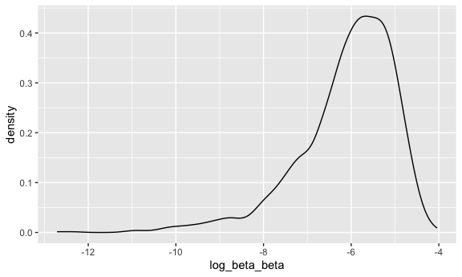

Homework 6
================
Ghislaine Jumonville
2023-12-01

## Problem 1

The code chunk below loads the Washington Post homicide data and creates
a new variable `city_state` that combines the city and state into one
variable, and a new binary variable `status` that indicates if the
homicide is solved or unsolved.

``` r
homicide =
  read_csv("homicide-data.csv") |> 
  janitor::clean_names() |> 
  mutate(
    city_state = paste(city, state, sep = ", "),
    status = case_match(disposition,
                       "Open/No arrest" ~ 1,
                       .default = 0),
    victim_age = as.numeric(victim_age),
    victim_race = as.factor(victim_race)) |> 
  filter(!city_state %in% c("Dallas, TX","Phoenix, AZ", "Kansas City, MO","Tulsa, AL"),
         victim_race %in% c("White", "Black")) 
```

    ## Rows: 52179 Columns: 12
    ## ── Column specification ────────────────────────────────────────────────────────
    ## Delimiter: ","
    ## chr (9): uid, victim_last, victim_first, victim_race, victim_age, victim_sex...
    ## dbl (3): reported_date, lat, lon
    ## 
    ## ℹ Use `spec()` to retrieve the full column specification for this data.
    ## ℹ Specify the column types or set `show_col_types = FALSE` to quiet this message.

Create a city_state variable (e.g. “Baltimore, MD”), and a binary
variable indicating whether the homicide is solved. Omit cities Dallas,
TX; Phoenix, AZ; and Kansas City, MO – these don’t report victim race.
Also omit Tulsa, AL – this is a data entry mistake. For this problem,
limit your analysis those for whom victim_race is white or black. Be
sure that victim_age is numeric.

For the city of Baltimore, MD, use the glm function to fit a logistic
regression with resolved vs unresolved as the outcome and victim age,
sex and race as predictors. Save the output of glm as an R object; apply
the broom::tidy to this object; and obtain the estimate and confidence
interval of the adjusted odds ratio for solving homicides comparing male
victims to female victims keeping all other variables fixed.

``` r
baltimore_fit = 
  homicide |> 
  filter(city_state == "Baltimore, MD") |> 
  glm(status ~ victim_age + victim_sex + victim_race, data = _, family = binomial())

broom::tidy(baltimore_fit)
```

    ## # A tibble: 4 × 5
    ##   term             estimate std.error statistic  p.value
    ##   <chr>               <dbl>     <dbl>     <dbl>    <dbl>
    ## 1 (Intercept)      -0.664     0.174       -3.80 1.42e- 4
    ## 2 victim_age        0.00520   0.00325      1.60 1.10e- 1
    ## 3 victim_sexMale    1.04      0.143        7.26 3.74e-13
    ## 4 victim_raceWhite -0.900     0.180       -4.99 6.04e- 7

OR = 1.04

Now run glm for each of the cities in your dataset, and extract the
adjusted odds ratio (and CI) for solving homicides comparing male
victims to female victims. Do this within a “tidy” pipeline, making use
of purrr::map, list columns, and unnest as necessary to create a
dataframe with estimated ORs and CIs for each city.

Create a plot that shows the estimated ORs and CIs for each city.
Organize cities according to estimated OR, and comment on the plot.

## Problem 2

``` r
weather_df = 
  rnoaa::meteo_pull_monitors(
    c("USW00094728"),
    var = c("PRCP", "TMIN", "TMAX"), 
    date_min = "2022-01-01",
    date_max = "2022-12-31") |>
  mutate(
    name = recode(id, USW00094728 = "CentralPark_NY"),
    tmin = tmin / 10,
    tmax = tmax / 10) |>
  select(name, id, everything())
```

    ## using cached file: /Users/ghislainejumonville/Library/Caches/org.R-project.R/R/rnoaa/noaa_ghcnd/USW00094728.dly

    ## date created (size, mb): 2023-09-28 10:19:32.942375 (8.524)

    ## file min/max dates: 1869-01-01 / 2023-09-30

The boostrap is helpful when you’d like to perform inference for a
parameter / value / summary that doesn’t have an easy-to-write-down
distribution in the usual repeated sampling framework. We’ll focus on a
simple linear regression with tmax as the response with tmin and prcp as
the predictors, and are interested in the distribution of two quantities
estimated from these data:

r̂ 2 log(β̂ 1∗β̂ 2)

Use 5000 bootstrap samples and, for each bootstrap sample, produce
estimates of these two quantities. Plot the distribution of your
estimates, and describe these in words. Using the 5000 bootstrap
estimates, identify the 2.5% and 97.5% quantiles to provide a 95%
confidence interval for r̂ 2 and log(β̂ 0∗β̂ 1) . Note: broom::glance() is
helpful for extracting r̂ 2 from a fitted regression, and broom::tidy()
(with some additional wrangling) should help in computing log(β̂ 1∗β̂ 2)

``` r
weather_bootstrap_data = 
weather_df |> 
  modelr::bootstrap(n = 5000) |> 
  mutate(
    models = map(strap, \(df) lm(tmax ~ tmin + prcp, data = df)),
    results_rsquare = map(models, broom::glance),
    results_beta = map(models, broom::tidy)) |> 
  select(results_rsquare, results_beta) |> 
  mutate(
    id = row_number()
  ) |> 
  unnest(results_rsquare) |> 
  select(r.squared, results_beta, id) |> 
  unnest(results_beta) |> 
  select(id, r.squared, term, estimate) |> 
  pivot_wider(names_from = term, values_from = estimate) |> 
  mutate(
    beta_beta = tmin*prcp,
    log_beta_beta = log(beta_beta)
  ) 
```

    ## Warning: There was 1 warning in `mutate()`.
    ## ℹ In argument: `log_beta_beta = log(beta_beta)`.
    ## Caused by warning in `log()`:
    ## ! NaNs produced

### Distribution of R-Squared Values

``` r
r_squared_distribution =
  weather_bootstrap_data |> 
  ggplot(aes(x = r.squared)) + 
    geom_density() +
    labs(title = "Distribution of R-Squared")
r_squared_distribution
```


### Distribution of Log(beta1\*beta2) Values

``` r
log_beta_beta_distribution =
  weather_bootstrap_data |> 
  ggplot(aes(x = log_beta_beta)) + 
    geom_density() + 
    labs(title = "Distribution of log(beta1*beta2)")
log_beta_beta_distribution
```



``` r
weather_bootstrap_data |> 
  summarize(
    ci_lower_rsquared = quantile(r.squared, 0.025), 
    ci_upper_rsquared = quantile(r.squared, 0.975),
    ci_lower_logbetabeta = quantile(log_beta_beta, 0.025, na.rm = TRUE),
    ci_upper_logbetabeta = quantile(log_beta_beta, 0.975, na.rm = TRUE)) |> 
  knitr::kable()
```

| ci_lower_rsquared | ci_upper_rsquared | ci_lower_logbetabeta | ci_upper_logbetabeta |
|------------------:|------------------:|---------------------:|---------------------:|
|         0.8882079 |         0.9402552 |            -9.063214 |            -4.619267 |

## Problem 3

``` r
birthweight_data =  
  read_csv("birthweight.csv") |> 
  janitor::clean_names() |> 
  mutate(
    babysex = factor(babysex),
    frace = factor(frace),
    mrace = factor(mrace)
  )
```

    ## Rows: 4342 Columns: 20
    ## ── Column specification ────────────────────────────────────────────────────────
    ## Delimiter: ","
    ## dbl (20): babysex, bhead, blength, bwt, delwt, fincome, frace, gaweeks, malf...
    ## 
    ## ℹ Use `spec()` to retrieve the full column specification for this data.
    ## ℹ Specify the column types or set `show_col_types = FALSE` to quiet this message.

``` r
skimr::skim(birthweight_data)
```

|                                                  |                  |
|:-------------------------------------------------|:-----------------|
| Name                                             | birthweight_data |
| Number of rows                                   | 4342             |
| Number of columns                                | 20               |
| \_\_\_\_\_\_\_\_\_\_\_\_\_\_\_\_\_\_\_\_\_\_\_   |                  |
| Column type frequency:                           |                  |
| factor                                           | 3                |
| numeric                                          | 17               |
| \_\_\_\_\_\_\_\_\_\_\_\_\_\_\_\_\_\_\_\_\_\_\_\_ |                  |
| Group variables                                  | None             |

Data summary

**Variable type: factor**

| skim_variable | n_missing | complete_rate | ordered | n_unique | top_counts                      |
|:--------------|----------:|--------------:|:--------|---------:|:--------------------------------|
| babysex       |         0 |             1 | FALSE   |        2 | 1: 2230, 2: 2112                |
| frace         |         0 |             1 | FALSE   |        5 | 1: 2123, 2: 1911, 4: 248, 3: 46 |
| mrace         |         0 |             1 | FALSE   |        4 | 1: 2147, 2: 1909, 4: 243, 3: 43 |

**Variable type: numeric**

| skim_variable | n_missing | complete_rate |    mean |     sd |     p0 |     p25 |     p50 |     p75 |   p100 | hist  |
|:--------------|----------:|--------------:|--------:|-------:|-------:|--------:|--------:|--------:|-------:|:------|
| bhead         |         0 |             1 |   33.65 |   1.62 |  21.00 |   33.00 |   34.00 |   35.00 |   41.0 | ▁▁▆▇▁ |
| blength       |         0 |             1 |   49.75 |   2.72 |  20.00 |   48.00 |   50.00 |   51.00 |   63.0 | ▁▁▁▇▁ |
| bwt           |         0 |             1 | 3114.40 | 512.15 | 595.00 | 2807.00 | 3132.50 | 3459.00 | 4791.0 | ▁▁▇▇▁ |
| delwt         |         0 |             1 |  145.57 |  22.21 |  86.00 |  131.00 |  143.00 |  157.00 |  334.0 | ▅▇▁▁▁ |
| fincome       |         0 |             1 |   44.11 |  25.98 |   0.00 |   25.00 |   35.00 |   65.00 |   96.0 | ▃▇▅▂▃ |
| gaweeks       |         0 |             1 |   39.43 |   3.15 |  17.70 |   38.30 |   39.90 |   41.10 |   51.3 | ▁▁▂▇▁ |
| malform       |         0 |             1 |    0.00 |   0.06 |   0.00 |    0.00 |    0.00 |    0.00 |    1.0 | ▇▁▁▁▁ |
| menarche      |         0 |             1 |   12.51 |   1.48 |   0.00 |   12.00 |   12.00 |   13.00 |   19.0 | ▁▁▂▇▁ |
| mheight       |         0 |             1 |   63.49 |   2.66 |  48.00 |   62.00 |   63.00 |   65.00 |   77.0 | ▁▁▇▂▁ |
| momage        |         0 |             1 |   20.30 |   3.88 |  12.00 |   18.00 |   20.00 |   22.00 |   44.0 | ▅▇▂▁▁ |
| parity        |         0 |             1 |    0.00 |   0.10 |   0.00 |    0.00 |    0.00 |    0.00 |    6.0 | ▇▁▁▁▁ |
| pnumlbw       |         0 |             1 |    0.00 |   0.00 |   0.00 |    0.00 |    0.00 |    0.00 |    0.0 | ▁▁▇▁▁ |
| pnumsga       |         0 |             1 |    0.00 |   0.00 |   0.00 |    0.00 |    0.00 |    0.00 |    0.0 | ▁▁▇▁▁ |
| ppbmi         |         0 |             1 |   21.57 |   3.18 |  13.07 |   19.53 |   21.03 |   22.91 |   46.1 | ▃▇▁▁▁ |
| ppwt          |         0 |             1 |  123.49 |  20.16 |  70.00 |  110.00 |  120.00 |  134.00 |  287.0 | ▅▇▁▁▁ |
| smoken        |         0 |             1 |    4.15 |   7.41 |   0.00 |    0.00 |    0.00 |    5.00 |   60.0 | ▇▁▁▁▁ |
| wtgain        |         0 |             1 |   22.08 |  10.94 | -46.00 |   15.00 |   22.00 |   28.00 |   89.0 | ▁▁▇▁▁ |

``` r
birthweight_data |> 
  ggplot(aes(x = bwt)) + geom_boxplot()
```


``` r
birthweight_model_1 = 
  lm(bwt ~ bhead + blength, data = birthweight_data)

broom::glance(birthweight_model_1)
```

    ## # A tibble: 1 × 12
    ##   r.squared adj.r.squared sigma statistic p.value    df  logLik    AIC    BIC
    ##       <dbl>         <dbl> <dbl>     <dbl>   <dbl> <dbl>   <dbl>  <dbl>  <dbl>
    ## 1     0.681         0.681  289.     4639.       0     2 -30766. 61540. 61565.
    ## # ℹ 3 more variables: deviance <dbl>, df.residual <int>, nobs <int>

``` r
broom::tidy(birthweight_model_1)
```

    ## # A tibble: 3 × 5
    ##   term        estimate std.error statistic   p.value
    ##   <chr>          <dbl>     <dbl>     <dbl>     <dbl>
    ## 1 (Intercept)  -6030.      95.8      -62.9 0        
    ## 2 bhead          146.       3.49      41.9 7.21e-322
    ## 3 blength         85.0      2.08      41.0 2.60e-310

``` r
birthweight_data |> 
  modelr::add_residuals(birthweight_model_1) |> 
  modelr::add_predictions(birthweight_model_1) |> 
  ggplot(aes(x = pred, y = resid)) + geom_point()
```


``` r
birthweight_data |> 
  modelr::add_residuals(birthweight_model_1) |> 
  ggplot(aes(x = resid)) + geom_histogram()
```

    ## `stat_bin()` using `bins = 30`. Pick better value with `binwidth`.


``` r
birthweight_model_2 =
  lm(bwt ~ blength + gaweeks, data = birthweight_data)

broom::glance(birthweight_model_2)
```

    ## # A tibble: 1 × 12
    ##   r.squared adj.r.squared sigma statistic p.value    df  logLik    AIC    BIC
    ##       <dbl>         <dbl> <dbl>     <dbl>   <dbl> <dbl>   <dbl>  <dbl>  <dbl>
    ## 1     0.577         0.577  333.     2958.       0     2 -31381. 62771. 62796.
    ## # ℹ 3 more variables: deviance <dbl>, df.residual <int>, nobs <int>

``` r
broom::tidy(birthweight_model_2)
```

    ## # A tibble: 3 × 5
    ##   term        estimate std.error statistic  p.value
    ##   <chr>          <dbl>     <dbl>     <dbl>    <dbl>
    ## 1 (Intercept)  -4348.      98.0      -44.4 0       
    ## 2 blength        129.       1.99      64.6 0       
    ## 3 gaweeks         27.0      1.72      15.7 2.36e-54

``` r
birthweight_model_3 =
  lm(bwt ~ bhead + blength + babysex + bhead*blength + bhead*babysex + blength*babysex + bhead*blength*babysex, data = birthweight_data)

broom::glance(birthweight_model_3)
```

    ## # A tibble: 1 × 12
    ##   r.squared adj.r.squared sigma statistic p.value    df  logLik    AIC    BIC
    ##       <dbl>         <dbl> <dbl>     <dbl>   <dbl> <dbl>   <dbl>  <dbl>  <dbl>
    ## 1     0.685         0.684  288.     1346.       0     7 -30742. 61501. 61559.
    ## # ℹ 3 more variables: deviance <dbl>, df.residual <int>, nobs <int>

``` r
broom::tidy(birthweight_model_3)
```

    ## # A tibble: 8 × 5
    ##   term                    estimate std.error statistic      p.value
    ##   <chr>                      <dbl>     <dbl>     <dbl>        <dbl>
    ## 1 (Intercept)            -7177.     1265.       -5.67  0.0000000149
    ## 2 bhead                    182.       38.1       4.78  0.00000184  
    ## 3 blength                  102.       26.2       3.90  0.0000992   
    ## 4 babysex2                6375.     1678.        3.80  0.000147    
    ## 5 bhead:blength             -0.554     0.780    -0.710 0.478       
    ## 6 bhead:babysex2          -198.       51.1      -3.88  0.000105    
    ## 7 blength:babysex2        -124.       35.1      -3.52  0.000429    
    ## 8 bhead:blength:babysex2     3.88      1.06      3.67  0.000245

``` r
cv_birthweight_df =
  crossv_mc(birthweight_data, 100) |> 
  mutate(
    train = map(train, as_tibble),
    test = map(test, as_tibble))
```

``` r
cv_birthweight_df = 
  cv_birthweight_df |> 
  mutate(
    birthweight_model_1  = map(train, \(df) lm(bwt ~ bhead + blength, data = birthweight_data)),
    birthweight_model_2  = map(train, \(df) lm(bwt ~ blength + gaweeks, data = birthweight_data)),
    birthweight_model_3  = map(train, \(df) lm(bwt ~ bhead + blength + babysex + bhead*blength + bhead*babysex + blength*babysex + bhead*blength*babysex, data = birthweight_data))) |> 
  mutate(
    rmse_1 = map2_dbl(birthweight_model_1, test, \(mod, df) rmse(model = mod, data = df)),
    rmse_2 = map2_dbl(birthweight_model_2, test, \(mod, df) rmse(model = mod, data = df)),
    rmse_3 = map2_dbl(birthweight_model_3, test, \(mod, df) rmse(model = mod, data = df)))
```

``` r
cv_birthweight_df |> 
  select(starts_with("rmse")) |> 
  pivot_longer(
    everything(),
    names_to = "model", 
    values_to = "rmse",
    names_prefix = "rmse_") |> 
  mutate(model = fct_inorder(model)) |> 
  ggplot(aes(x = model, y = rmse)) + geom_violin()
```


One using head circumference, length, sex, and all interactions
(including the three-way interaction) between these

In this problem, you will analyze data gathered to understand the
effects of several variables on a child’s birthweight. This dataset,
available here, consists of roughly 4000 children and includes the
following variables:

babysex: baby’s sex (male = 1, female = 2) bhead: baby’s head
circumference at birth (centimeters) blength: baby’s length at birth
(centimeteres) bwt: baby’s birth weight (grams) delwt: mother’s weight
at delivery (pounds) fincome: family monthly income (in hundreds,
rounded) frace: father’s race (1 = White, 2 = Black, 3 = Asian, 4 =
Puerto Rican, 8 = Other, 9 = Unknown) gaweeks: gestational age in weeks
malform: presence of malformations that could affect weight (0 = absent,
1 = present) menarche: mother’s age at menarche (years) mheigth:
mother’s height (inches) momage: mother’s age at delivery (years) mrace:
mother’s race (1 = White, 2 = Black, 3 = Asian, 4 = Puerto Rican, 8 =
Other) parity: number of live births prior to this pregnancy pnumlbw:
previous number of low birth weight babies pnumgsa: number of prior
small for gestational age babies ppbmi: mother’s pre-pregnancy BMI ppwt:
mother’s pre-pregnancy weight (pounds) smoken: average number of
cigarettes smoked per day during pregnancy wtgain: mother’s weight gain
during pregnancy (pounds)

Load and clean the data for regression analysis (i.e. convert numeric to
factor where appropriate, check for missing data, etc.).

Propose a regression model for birthweight. This model may be based on a
hypothesized structure for the factors that underly birthweight, on a
data-driven model-building process, or a combination of the two.
Describe your modeling process and show a plot of model residuals
against fitted values – use add_predictions and add_residuals in making
this plot.

Compare your model to two others:

One using length at birth and gestational age as predictors (main
effects only) One using head circumference, length, sex, and all
interactions (including the three-way interaction) between these Make
this comparison in terms of the cross-validated prediction error; use
crossv_mc and functions in purrr as appropriate.

Note that although we expect your model to be reasonable, model building
itself is not a main idea of the course and we don’t necessarily expect
your model to be “optimal”.
