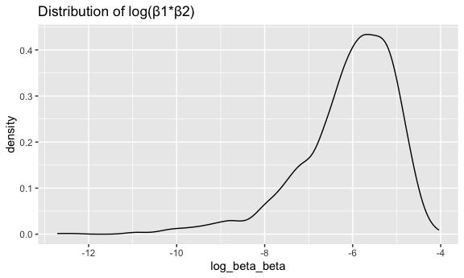
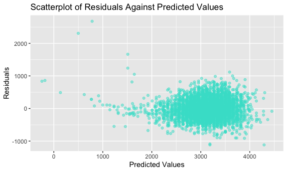
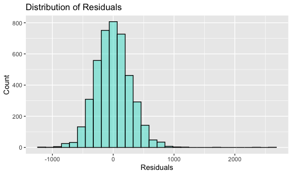
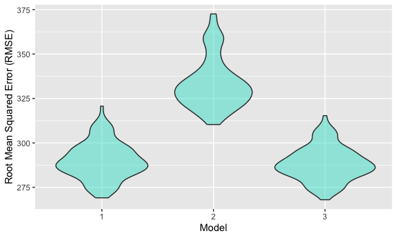

Homework 6
================
Ghislaine Jumonville
2023-12-01

## Problem 1

The code chunk below loads the Washington Post homicide data and creates
a new variable `city_state` that combines the city and state into one
variable, and a new binary variable `status` that indicates if the
homicide is solved or unsolved.

``` r
homicide =
  read_csv("homicide-data.csv") |> 
  janitor::clean_names() |> 
  mutate(
    city_state = paste(city, state, sep = ", "),
    status = case_match(disposition,
                       "Open/No arrest" ~ 1,
                       .default = 0),
    victim_age = as.numeric(victim_age),
    victim_race = as.factor(victim_race)) |> 
  filter(!city_state %in% c("Dallas, TX","Phoenix, AZ", "Kansas City, MO","Tulsa, AL"),
         victim_race %in% c("White", "Black")) 
```

Create a city_state variable (e.g. “Baltimore, MD”), and a binary
variable indicating whether the homicide is solved. Omit cities Dallas,
TX; Phoenix, AZ; and Kansas City, MO – these don’t report victim race.
Also omit Tulsa, AL – this is a data entry mistake. For this problem,
limit your analysis those for whom victim_race is white or black. Be
sure that victim_age is numeric.

For the city of Baltimore, MD, use the glm function to fit a logistic
regression with resolved vs unresolved as the outcome and victim age,
sex and race as predictors. Save the output of glm as an R object; apply
the broom::tidy to this object; and obtain the estimate and confidence
interval of the adjusted odds ratio for solving homicides comparing male
victims to female victims keeping all other variables fixed.

``` r
baltimore_fit = 
  homicide |> 
  filter(city_state == "Baltimore, MD") |> 
  glm(status ~ victim_age + victim_sex + victim_race, data = _, family = binomial())

broom::tidy(baltimore_fit)
```

    ## # A tibble: 4 × 5
    ##   term             estimate std.error statistic  p.value
    ##   <chr>               <dbl>     <dbl>     <dbl>    <dbl>
    ## 1 (Intercept)      -0.664     0.174       -3.80 1.42e- 4
    ## 2 victim_age        0.00520   0.00325      1.60 1.10e- 1
    ## 3 victim_sexMale    1.04      0.143        7.26 3.74e-13
    ## 4 victim_raceWhite -0.900     0.180       -4.99 6.04e- 7

estimate = 1.04

Now run glm for each of the cities in your dataset, and extract the
adjusted odds ratio (and CI) for solving homicides comparing male
victims to female victims. Do this within a “tidy” pipeline, making use
of purrr::map, list columns, and unnest as necessary to create a
dataframe with estimated ORs and CIs for each city.

Create a plot that shows the estimated ORs and CIs for each city.
Organize cities according to estimated OR, and comment on the plot.

## Problem 2

``` r
weather_df = 
  rnoaa::meteo_pull_monitors(
    c("USW00094728"),
    var = c("PRCP", "TMIN", "TMAX"), 
    date_min = "2022-01-01",
    date_max = "2022-12-31") |>
  mutate(
    name = recode(id, USW00094728 = "CentralPark_NY"),
    tmin = tmin / 10,
    tmax = tmax / 10) |>
  select(name, id, everything())
```

    ## using cached file: /Users/ghislainejumonville/Library/Caches/org.R-project.R/R/rnoaa/noaa_ghcnd/USW00094728.dly

    ## date created (size, mb): 2023-09-28 10:19:32.942375 (8.524)

    ## file min/max dates: 1869-01-01 / 2023-09-30

The boostrap is helpful when you’d like to perform inference for a
parameter / value / summary that doesn’t have an easy-to-write-down
distribution in the usual repeated sampling framework. We’ll focus on a
simple linear regression with tmax as the response with tmin and prcp as
the predictors, and are interested in the distribution of two quantities
estimated from these data:

r̂ 2 log(β̂ 1∗β̂ 2)

Use 5000 bootstrap samples and, for each bootstrap sample, produce
estimates of these two quantities. Plot the distribution of your
estimates, and describe these in words. Using the 5000 bootstrap
estimates, identify the 2.5% and 97.5% quantiles to provide a 95%
confidence interval for r̂ 2 and log(β̂ 0∗β̂ 1) . Note: broom::glance() is
helpful for extracting r̂ 2 from a fitted regression, and broom::tidy()
(with some additional wrangling) should help in computing log(β̂ 1∗β̂ 2)

``` r
weather_bootstrap_data = 
weather_df |> 
  modelr::bootstrap(n = 5000) |> 
  mutate(
    models = map(strap, \(df) lm(tmax ~ tmin + prcp, data = df)),
    results_rsquare = map(models, broom::glance),
    results_beta = map(models, broom::tidy)) |> 
  select(results_rsquare, results_beta) |> 
  mutate(
    id = row_number()
  ) |> 
  unnest(results_rsquare) |> 
  select(r.squared, results_beta, id) |> 
  unnest(results_beta) |> 
  select(id, r.squared, term, estimate) |> 
  pivot_wider(names_from = term, values_from = estimate) |> 
  mutate(
    beta_beta = tmin*prcp,
    log_beta_beta = log(beta_beta)
  ) 
```

### Distribution of R-Squared Values

``` r
r_squared_distribution =
  weather_bootstrap_data |> 
  ggplot(aes(x = r.squared)) + 
    geom_density() +
    labs(title = "Distribution of R-Squared")
r_squared_distribution
```


### Distribution of Log(beta1\*beta2) Values

``` r
log_beta_beta_distribution =
  weather_bootstrap_data |> 
  ggplot(aes(x = log_beta_beta)) + 
    geom_density() + 
    labs(title = "Distribution of log(beta1*beta2)")
log_beta_beta_distribution
```



``` r
weather_bootstrap_data |> 
  summarize(
    ci_lower_rsquared = quantile(r.squared, 0.025), 
    ci_upper_rsquared = quantile(r.squared, 0.975),
    ci_lower_logbetabeta = quantile(log_beta_beta, 0.025, na.rm = TRUE),
    ci_upper_logbetabeta = quantile(log_beta_beta, 0.975, na.rm = TRUE)) |> 
  knitr::kable()
```

| ci_lower_rsquared | ci_upper_rsquared | ci_lower_logbetabeta | ci_upper_logbetabeta |
|------------------:|------------------:|---------------------:|---------------------:|
|         0.8882079 |         0.9402552 |            -9.063214 |            -4.619267 |

## Problem 3

The code chunk below loads and cleans the `birthweight.csv` dataset. Sex
(`babysex`), father’s race(`frace`), and mother’s race (`mrace`) were
converted to factors.

``` r
birthweight_data =  
  read_csv("birthweight.csv") |> 
  janitor::clean_names() |> 
  mutate(
    babysex = factor(babysex),
    frace = factor(frace),
    mrace = factor(mrace)
  )
```

    ## Rows: 4342 Columns: 20
    ## ── Column specification ────────────────────────────────────────────────────────
    ## Delimiter: ","
    ## dbl (20): babysex, bhead, blength, bwt, delwt, fincome, frace, gaweeks, malf...
    ## 
    ## ℹ Use `spec()` to retrieve the full column specification for this data.
    ## ℹ Specify the column types or set `show_col_types = FALSE` to quiet this message.

``` r
skimr::skim(birthweight_data)
```

|                                                  |                  |
|:-------------------------------------------------|:-----------------|
| Name                                             | birthweight_data |
| Number of rows                                   | 4342             |
| Number of columns                                | 20               |
| \_\_\_\_\_\_\_\_\_\_\_\_\_\_\_\_\_\_\_\_\_\_\_   |                  |
| Column type frequency:                           |                  |
| factor                                           | 3                |
| numeric                                          | 17               |
| \_\_\_\_\_\_\_\_\_\_\_\_\_\_\_\_\_\_\_\_\_\_\_\_ |                  |
| Group variables                                  | None             |

Data summary

**Variable type: factor**

| skim_variable | n_missing | complete_rate | ordered | n_unique | top_counts                      |
|:--------------|----------:|--------------:|:--------|---------:|:--------------------------------|
| babysex       |         0 |             1 | FALSE   |        2 | 1: 2230, 2: 2112                |
| frace         |         0 |             1 | FALSE   |        5 | 1: 2123, 2: 1911, 4: 248, 3: 46 |
| mrace         |         0 |             1 | FALSE   |        4 | 1: 2147, 2: 1909, 4: 243, 3: 43 |

**Variable type: numeric**

| skim_variable | n_missing | complete_rate |    mean |     sd |     p0 |     p25 |     p50 |     p75 |   p100 | hist  |
|:--------------|----------:|--------------:|--------:|-------:|-------:|--------:|--------:|--------:|-------:|:------|
| bhead         |         0 |             1 |   33.65 |   1.62 |  21.00 |   33.00 |   34.00 |   35.00 |   41.0 | ▁▁▆▇▁ |
| blength       |         0 |             1 |   49.75 |   2.72 |  20.00 |   48.00 |   50.00 |   51.00 |   63.0 | ▁▁▁▇▁ |
| bwt           |         0 |             1 | 3114.40 | 512.15 | 595.00 | 2807.00 | 3132.50 | 3459.00 | 4791.0 | ▁▁▇▇▁ |
| delwt         |         0 |             1 |  145.57 |  22.21 |  86.00 |  131.00 |  143.00 |  157.00 |  334.0 | ▅▇▁▁▁ |
| fincome       |         0 |             1 |   44.11 |  25.98 |   0.00 |   25.00 |   35.00 |   65.00 |   96.0 | ▃▇▅▂▃ |
| gaweeks       |         0 |             1 |   39.43 |   3.15 |  17.70 |   38.30 |   39.90 |   41.10 |   51.3 | ▁▁▂▇▁ |
| malform       |         0 |             1 |    0.00 |   0.06 |   0.00 |    0.00 |    0.00 |    0.00 |    1.0 | ▇▁▁▁▁ |
| menarche      |         0 |             1 |   12.51 |   1.48 |   0.00 |   12.00 |   12.00 |   13.00 |   19.0 | ▁▁▂▇▁ |
| mheight       |         0 |             1 |   63.49 |   2.66 |  48.00 |   62.00 |   63.00 |   65.00 |   77.0 | ▁▁▇▂▁ |
| momage        |         0 |             1 |   20.30 |   3.88 |  12.00 |   18.00 |   20.00 |   22.00 |   44.0 | ▅▇▂▁▁ |
| parity        |         0 |             1 |    0.00 |   0.10 |   0.00 |    0.00 |    0.00 |    0.00 |    6.0 | ▇▁▁▁▁ |
| pnumlbw       |         0 |             1 |    0.00 |   0.00 |   0.00 |    0.00 |    0.00 |    0.00 |    0.0 | ▁▁▇▁▁ |
| pnumsga       |         0 |             1 |    0.00 |   0.00 |   0.00 |    0.00 |    0.00 |    0.00 |    0.0 | ▁▁▇▁▁ |
| ppbmi         |         0 |             1 |   21.57 |   3.18 |  13.07 |   19.53 |   21.03 |   22.91 |   46.1 | ▃▇▁▁▁ |
| ppwt          |         0 |             1 |  123.49 |  20.16 |  70.00 |  110.00 |  120.00 |  134.00 |  287.0 | ▅▇▁▁▁ |
| smoken        |         0 |             1 |    4.15 |   7.41 |   0.00 |    0.00 |    0.00 |    5.00 |   60.0 | ▇▁▁▁▁ |
| wtgain        |         0 |             1 |   22.08 |  10.94 | -46.00 |   15.00 |   22.00 |   28.00 |   89.0 | ▁▁▇▁▁ |

The code chunk below creates a histogram and boxplot of the
birthweights.

``` r
birthweight_data |>
  ggplot(aes(x = bwt)) + 
  geom_histogram(color = "black", fill = "turquoise", alpha = 0.5) +
  labs(
    title = "Distribution of Birthweights",
    x = "Birthweight (grams)",
    y = "Count"
  )
```

    ## `stat_bin()` using `bins = 30`. Pick better value with `binwidth`.


``` r
birthweight_data |> 
  ggplot(aes(x = bwt)) + 
  geom_boxplot(color = "black", fill = "turquoise", alpha = 0.5) +
  labs(
    title = "Distribution of Birthweights",
    x = "Birthweight (grams)" 
  )
```


Looking at the histogram of birthweights, it looks approximately
normally distributed. Then looking at the boxplot of the birthweights,
there are a few outliers on each end of the data. The outliers will
likely impact our model and our residuals.

When building this model, I started with only two variables: baby’s head
circumference at birth (`bhead`) and baby’s length at birth (`blength`),
which ended up being the two covariates that I settled on for my final
model. I considered that the length of the baby as well as its head
circumference would be very indicative of the overall birthweight of the
baby. I played around with adding other variables, but it did not add
much in terms of changing the r-squared value and at times lowered my
r-squared value. Therefore, I decided to stick with just the two
variables to keep the model as simple as possible while maintaining a
high r-squared value.

``` r
birthweight_model_1 = 
  lm(bwt ~ bhead + blength, data = birthweight_data)

broom::glance(birthweight_model_1)
```

    ## # A tibble: 1 × 12
    ##   r.squared adj.r.squared sigma statistic p.value    df  logLik    AIC    BIC
    ##       <dbl>         <dbl> <dbl>     <dbl>   <dbl> <dbl>   <dbl>  <dbl>  <dbl>
    ## 1     0.681         0.681  289.     4639.       0     2 -30766. 61540. 61565.
    ## # ℹ 3 more variables: deviance <dbl>, df.residual <int>, nobs <int>

``` r
broom::tidy(birthweight_model_1)
```

    ## # A tibble: 3 × 5
    ##   term        estimate std.error statistic   p.value
    ##   <chr>          <dbl>     <dbl>     <dbl>     <dbl>
    ## 1 (Intercept)  -6030.      95.8      -62.9 0        
    ## 2 bhead          146.       3.49      41.9 7.21e-322
    ## 3 blength         85.0      2.08      41.0 2.60e-310

The code chunk below creates a scatterplot of the residuals agains the
predicted values and creates a histogram of the residuals.

``` r
birthweight_data |> 
  modelr::add_residuals(birthweight_model_1) |> 
  modelr::add_predictions(birthweight_model_1) |> 
  ggplot(aes(x = pred, y = resid)) + 
  geom_point(color = "turquoise", alpha = 0.5) +
  labs(
    title = "Scatterplot of Residuals Against Predicted Values",
    x= "Predicted Values",
    y= "Residuals"
  )
```



``` r
birthweight_data |> 
  modelr::add_residuals(birthweight_model_1) |> 
  ggplot(aes(x = resid)) + 
  geom_histogram(color = "black", fill = "turquoise", alpha = 0.5) +
  labs(
    title = "Distribution of Residuals",
    x = "Residuals",
    y = "Count"
  )
```

    ## `stat_bin()` using `bins = 30`. Pick better value with `binwidth`.


The scatterplot of the residuals against the predicted values shows most
of the residuals randomly clustering around 0, which is a good sign for
the model. There is evidence of a few outliers on both ends, but the
original dataset contained quite a few outliers and without doing more
investigation and analysis there is not much that can be done.

The histogram shows that the residuals are approximately normally
distributed, which is further evidence that the model is doing a decent
job of fitting the data.

The code chunk below creates a model using length at birth and
gestational age as predictors of birthweight.

``` r
birthweight_model_2 =
  lm(bwt ~ blength + gaweeks, data = birthweight_data)

broom::glance(birthweight_model_2)
```

    ## # A tibble: 1 × 12
    ##   r.squared adj.r.squared sigma statistic p.value    df  logLik    AIC    BIC
    ##       <dbl>         <dbl> <dbl>     <dbl>   <dbl> <dbl>   <dbl>  <dbl>  <dbl>
    ## 1     0.577         0.577  333.     2958.       0     2 -31381. 62771. 62796.
    ## # ℹ 3 more variables: deviance <dbl>, df.residual <int>, nobs <int>

``` r
broom::tidy(birthweight_model_2)
```

    ## # A tibble: 3 × 5
    ##   term        estimate std.error statistic  p.value
    ##   <chr>          <dbl>     <dbl>     <dbl>    <dbl>
    ## 1 (Intercept)  -4348.      98.0      -44.4 0       
    ## 2 blength        129.       1.99      64.6 0       
    ## 3 gaweeks         27.0      1.72      15.7 2.36e-54

The code chunk below creates a model using baby’s head circumference,
baby’s length, the baby’s sex, and all the interactions as predictors of
birthweight.

``` r
birthweight_model_3 =
  lm(bwt ~ bhead + blength + babysex + bhead*blength*babysex, data = birthweight_data)

broom::glance(birthweight_model_3)
```

    ## # A tibble: 1 × 12
    ##   r.squared adj.r.squared sigma statistic p.value    df  logLik    AIC    BIC
    ##       <dbl>         <dbl> <dbl>     <dbl>   <dbl> <dbl>   <dbl>  <dbl>  <dbl>
    ## 1     0.685         0.684  288.     1346.       0     7 -30742. 61501. 61559.
    ## # ℹ 3 more variables: deviance <dbl>, df.residual <int>, nobs <int>

``` r
broom::tidy(birthweight_model_3)
```

    ## # A tibble: 8 × 5
    ##   term                    estimate std.error statistic      p.value
    ##   <chr>                      <dbl>     <dbl>     <dbl>        <dbl>
    ## 1 (Intercept)            -7177.     1265.       -5.67  0.0000000149
    ## 2 bhead                    182.       38.1       4.78  0.00000184  
    ## 3 blength                  102.       26.2       3.90  0.0000992   
    ## 4 babysex2                6375.     1678.        3.80  0.000147    
    ## 5 bhead:blength             -0.554     0.780    -0.710 0.478       
    ## 6 bhead:babysex2          -198.       51.1      -3.88  0.000105    
    ## 7 blength:babysex2        -124.       35.1      -3.52  0.000429    
    ## 8 bhead:blength:babysex2     3.88      1.06      3.67  0.000245

The code chunk below generates 100 cross-validation folds for the
`birthweight_data` and splits that data into training and testing sets.

``` r
cv_birthweight_df =
  crossv_mc(birthweight_data, 100) |> 
  mutate(
    train = map(train, as_tibble),
    test = map(test, as_tibble))
```

The code chunk below performs cross-validated linear regression modeling
on the `birthweight_data`, assessing the root mean squared error (RSME)
for the three models created. This allows us to assess which models are
doing a good job at predicting our data.

``` r
cv_birthweight_df = 
  cv_birthweight_df |> 
  mutate(
    birthweight_model_1  = map(train, \(df) lm(bwt ~ bhead + blength, data = birthweight_data)),
    birthweight_model_2  = map(train, \(df) lm(bwt ~ blength + gaweeks, data = birthweight_data)),
    birthweight_model_3  = map(train, \(df) lm(bwt ~ bhead + blength + babysex + bhead*blength + bhead*babysex + blength*babysex + bhead*blength*babysex, data = birthweight_data))) |> 
  mutate(
    rmse_1 = map2_dbl(birthweight_model_1, test, \(mod, df) rmse(model = mod, data = df)),
    rmse_2 = map2_dbl(birthweight_model_2, test, \(mod, df) rmse(model = mod, data = df)),
    rmse_3 = map2_dbl(birthweight_model_3, test, \(mod, df) rmse(model = mod, data = df)))
```

The code chunk below creates a violin plots for each of the models.

``` r
cv_birthweight_df |> 
  select(starts_with("rmse")) |> 
  pivot_longer(
    everything(),
    names_to = "model", 
    values_to = "rmse",
    names_prefix = "rmse_") |> 
  mutate(model = fct_inorder(model)) |> 
  ggplot(aes(x = model, y = rmse)) + 
    geom_violin(fill = "turquoise", alpha = 0.5) +
    labs(
      x = "Model",
      y = "Root Mean Squared Error (RMSE)"
    )
```



Looking at this plot, Model 1 and Model 3 have roughly similar
prediction accuracies, while Model 2 has the worse prediction accuracy.
Model 3 includes 7 predictors (3 main effects) and only appears to only
be slightly better at predicting birthweight than Model 1 which contains
2 predictors (main effects only).
