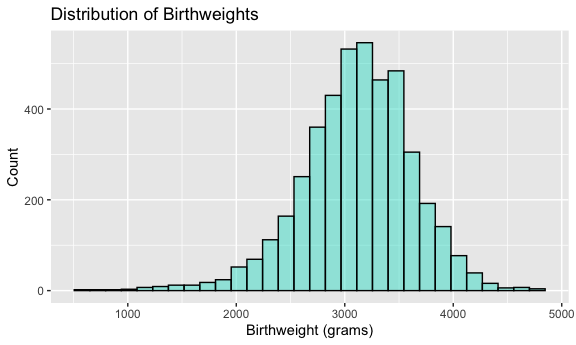

Homework 6
================
Ghislaine Jumonville
2023-12-01

## Problem 1

The code chunk below loads the Washington Post homicide data and creates
a new variable `city_state` that combines the city and state into one
variable, and a new binary variable `status` that indicates if the
homicide is solved or unsolved.

``` r
homicide =
  read_csv("homicide-data.csv") |> 
  janitor::clean_names() |> 
  mutate(
    city_state = paste(city, state, sep = ", "),
    status = case_match(disposition,
                       "Open/No arrest" ~ 1,
                       .default = 0),
    victim_age = as.numeric(victim_age),
    victim_race = as.factor(victim_race)) |> 
  filter(!city_state %in% c("Dallas, TX","Phoenix, AZ", "Kansas City, MO","Tulsa, AL"),
         victim_race %in% c("White", "Black")) 
```

The code chunk below fits a logistic regression with solved/unsolved as
the outcome and victim age, sex, and race as predictors.

``` r
baltimore_fit = 
  homicide |> 
  filter(city_state == "Baltimore, MD") |> 
  glm(status ~ victim_age + victim_sex + victim_race, data = _, family = binomial())

broom::tidy(baltimore_fit) |> 
  mutate(
    OR = exp(estimate),
    lower_CI = exp(estimate - (1.96*std.error)),
    upper_CI = exp(estimate + (1.96*std.error))
  ) |> 
  knitr::kable()
```

| term             |   estimate | std.error | statistic |   p.value |        OR |  lower_CI |  upper_CI |
|:-----------------|-----------:|----------:|----------:|----------:|----------:|----------:|----------:|
| (Intercept)      | -0.6637919 | 0.1744953 | -3.804068 | 0.0001423 | 0.5148952 | 0.3657510 | 0.7248568 |
| victim_age       |  0.0052046 | 0.0032546 |  1.599137 | 0.1097901 | 1.0052182 | 0.9988262 | 1.0116510 |
| victim_sexMale   |  1.0365643 | 0.1426890 |  7.264500 | 0.0000000 | 2.8195132 | 2.1316446 | 3.7293529 |
| victim_raceWhite | -0.8997135 | 0.1803042 | -4.989976 | 0.0000006 | 0.4066861 | 0.2856152 | 0.5790784 |

Adjusting for age and race, homicides that involve males have 2.82 times
the odds (95% CI: 2.13, 3.73) of being solved compared to homicides that
involve females.

## Problem 2

The code chunk below loads in the weather data and creates a new
dataframe `weather_df`.

``` r
weather_df = 
  rnoaa::meteo_pull_monitors(
    c("USW00094728"),
    var = c("PRCP", "TMIN", "TMAX"), 
    date_min = "2022-01-01",
    date_max = "2022-12-31") |>
  mutate(
    name = recode(id, USW00094728 = "CentralPark_NY"),
    tmin = tmin / 10,
    tmax = tmax / 10) |>
  select(name, id, everything())
```

The code chunk below creates 5000 bootstrap samples with estimates of
r-squared and log(β1\*β2).

``` r
weather_bootstrap_data = 
weather_df |> 
  modelr::bootstrap(n = 5000) |> 
  mutate(
    models = map(strap, \(df) lm(tmax ~ tmin + prcp, data = df)),
    results_rsquare = map(models, broom::glance),
    results_beta = map(models, broom::tidy)) |> 
  select(results_rsquare, results_beta) |> 
  mutate(
    id = row_number()
  ) |> 
  unnest(results_rsquare) |> 
  select(r.squared, results_beta, id) |> 
  unnest(results_beta) |> 
  select(id, r.squared, term, estimate) |> 
  pivot_wider(names_from = term, values_from = estimate) |> 
  mutate(
    beta_beta = tmin*prcp,
    log_beta_beta = log(beta_beta)
  ) 
```

### Distribution of R-Squared Values

The code chunk below creates a density graph for the r-squared estimates
from the 5000 bootstrap samples.

``` r
r_squared_distribution =
  weather_bootstrap_data |> 
  ggplot(aes(x = r.squared)) + 
    geom_density() +
    labs(title = "Distribution of R-Squared")
r_squared_distribution
```


The distribution of r-squared estimates from the 5000 bootstrap samples
is approximately normally distributed with a mean around 0.92.

### Distribution of Log(β1\*β2) Values

The code chunk below creates a density graph for the log(β1\*β2)
estimates from the 5000 bootstrap samples.

``` r
log_beta_beta_distribution =
  weather_bootstrap_data |> 
  ggplot(aes(x = log_beta_beta)) + 
    geom_density() + 
    labs(title = "Distribution of log(β1*β2)")
log_beta_beta_distribution
```


This distribution is left skewed with most of the values falling between
-8 and -4.

The code chunk below creates a 95% confidence interval for the r-squared
and log(β1\*β2) estimates.

``` r
weather_bootstrap_data |> 
  summarize(
    ci_lower_rsquared = quantile(r.squared, 0.025), 
    ci_upper_rsquared = quantile(r.squared, 0.975),
    ci_lower_logbetabeta = quantile(log_beta_beta, 0.025, na.rm = TRUE),
    ci_upper_logbetabeta = quantile(log_beta_beta, 0.975, na.rm = TRUE)) |> 
  knitr::kable(digits = 4)
```

| ci_lower_rsquared | ci_upper_rsquared | ci_lower_logbetabeta | ci_upper_logbetabeta |
|------------------:|------------------:|---------------------:|---------------------:|
|            0.8882 |            0.9403 |              -9.0632 |              -4.6193 |

## Problem 3

The code chunk below loads and cleans the `birthweight.csv` dataset. Sex
(`babysex`), father’s race(`frace`), and mother’s race (`mrace`) were
converted to factors.

``` r
birthweight_data =  
  read_csv("birthweight.csv") |> 
  janitor::clean_names() |> 
  mutate(
    babysex = factor(babysex),
    frace = factor(frace),
    mrace = factor(mrace)
  )

skimr::skim(birthweight_data)
```

|                                                  |                  |
|:-------------------------------------------------|:-----------------|
| Name                                             | birthweight_data |
| Number of rows                                   | 4342             |
| Number of columns                                | 20               |
| \_\_\_\_\_\_\_\_\_\_\_\_\_\_\_\_\_\_\_\_\_\_\_   |                  |
| Column type frequency:                           |                  |
| factor                                           | 3                |
| numeric                                          | 17               |
| \_\_\_\_\_\_\_\_\_\_\_\_\_\_\_\_\_\_\_\_\_\_\_\_ |                  |
| Group variables                                  | None             |

Data summary

**Variable type: factor**

| skim_variable | n_missing | complete_rate | ordered | n_unique | top_counts                      |
|:--------------|----------:|--------------:|:--------|---------:|:--------------------------------|
| babysex       |         0 |             1 | FALSE   |        2 | 1: 2230, 2: 2112                |
| frace         |         0 |             1 | FALSE   |        5 | 1: 2123, 2: 1911, 4: 248, 3: 46 |
| mrace         |         0 |             1 | FALSE   |        4 | 1: 2147, 2: 1909, 4: 243, 3: 43 |

**Variable type: numeric**

| skim_variable | n_missing | complete_rate |    mean |     sd |     p0 |     p25 |     p50 |     p75 |   p100 | hist  |
|:--------------|----------:|--------------:|--------:|-------:|-------:|--------:|--------:|--------:|-------:|:------|
| bhead         |         0 |             1 |   33.65 |   1.62 |  21.00 |   33.00 |   34.00 |   35.00 |   41.0 | ▁▁▆▇▁ |
| blength       |         0 |             1 |   49.75 |   2.72 |  20.00 |   48.00 |   50.00 |   51.00 |   63.0 | ▁▁▁▇▁ |
| bwt           |         0 |             1 | 3114.40 | 512.15 | 595.00 | 2807.00 | 3132.50 | 3459.00 | 4791.0 | ▁▁▇▇▁ |
| delwt         |         0 |             1 |  145.57 |  22.21 |  86.00 |  131.00 |  143.00 |  157.00 |  334.0 | ▅▇▁▁▁ |
| fincome       |         0 |             1 |   44.11 |  25.98 |   0.00 |   25.00 |   35.00 |   65.00 |   96.0 | ▃▇▅▂▃ |
| gaweeks       |         0 |             1 |   39.43 |   3.15 |  17.70 |   38.30 |   39.90 |   41.10 |   51.3 | ▁▁▂▇▁ |
| malform       |         0 |             1 |    0.00 |   0.06 |   0.00 |    0.00 |    0.00 |    0.00 |    1.0 | ▇▁▁▁▁ |
| menarche      |         0 |             1 |   12.51 |   1.48 |   0.00 |   12.00 |   12.00 |   13.00 |   19.0 | ▁▁▂▇▁ |
| mheight       |         0 |             1 |   63.49 |   2.66 |  48.00 |   62.00 |   63.00 |   65.00 |   77.0 | ▁▁▇▂▁ |
| momage        |         0 |             1 |   20.30 |   3.88 |  12.00 |   18.00 |   20.00 |   22.00 |   44.0 | ▅▇▂▁▁ |
| parity        |         0 |             1 |    0.00 |   0.10 |   0.00 |    0.00 |    0.00 |    0.00 |    6.0 | ▇▁▁▁▁ |
| pnumlbw       |         0 |             1 |    0.00 |   0.00 |   0.00 |    0.00 |    0.00 |    0.00 |    0.0 | ▁▁▇▁▁ |
| pnumsga       |         0 |             1 |    0.00 |   0.00 |   0.00 |    0.00 |    0.00 |    0.00 |    0.0 | ▁▁▇▁▁ |
| ppbmi         |         0 |             1 |   21.57 |   3.18 |  13.07 |   19.53 |   21.03 |   22.91 |   46.1 | ▃▇▁▁▁ |
| ppwt          |         0 |             1 |  123.49 |  20.16 |  70.00 |  110.00 |  120.00 |  134.00 |  287.0 | ▅▇▁▁▁ |
| smoken        |         0 |             1 |    4.15 |   7.41 |   0.00 |    0.00 |    0.00 |    5.00 |   60.0 | ▇▁▁▁▁ |
| wtgain        |         0 |             1 |   22.08 |  10.94 | -46.00 |   15.00 |   22.00 |   28.00 |   89.0 | ▁▁▇▁▁ |

The code chunk below creates a histogram and boxplot of the
birthweights.

``` r
birthweight_data |>
  ggplot(aes(x = bwt)) + 
  geom_histogram(color = "black", fill = "turquoise", alpha = 0.5) +
  labs(
    title = "Distribution of Birthweights",
    x = "Birthweight (grams)",
    y = "Count"
  )
```



``` r
birthweight_data |> 
  ggplot(aes(x = bwt)) + 
  geom_boxplot(color = "black", fill = "turquoise", alpha = 0.5) +
  labs(
    title = "Distribution of Birthweights",
    x = "Birthweight (grams)" 
  )
```


Looking at the histogram of birthweights, it looks approximately
normally distributed. Then looking at the boxplot of the birthweights,
there are a few outliers on each end of the data. The outliers will
likely impact our model and our residuals.

When building this model, I started with only two variables: baby’s head
circumference at birth (`bhead`) and baby’s length at birth (`blength`),
which ended up being the two covariates that I settled on for my final
model. I considered that the length of the baby as well as its head
circumference would be very indicative of the overall birthweight of the
baby. I played around with adding other variables, but it did not add
much in terms of changing the r-squared value and at times lowered my
r-squared value. Therefore, I decided to stick with just the two
variables to keep the model as simple as possible while maintaining a
high r-squared value.

``` r
birthweight_model_1 = 
  lm(bwt ~ bhead + blength, data = birthweight_data)

broom::glance(birthweight_model_1) |> knitr::kable(digits = 3)
```

| r.squared | adj.r.squared |   sigma | statistic | p.value |  df |    logLik |      AIC |      BIC |  deviance | df.residual | nobs |
|----------:|--------------:|--------:|----------:|--------:|----:|----------:|---------:|---------:|----------:|------------:|-----:|
|     0.681 |         0.681 | 289.173 |   4638.91 |       0 |   2 | -30765.75 | 61539.51 | 61565.01 | 362831534 |        4339 | 4342 |

``` r
broom::tidy(birthweight_model_1) |> knitr::kable(digits = 3)
```

| term        |  estimate | std.error | statistic | p.value |
|:------------|----------:|----------:|----------:|--------:|
| (Intercept) | -6029.620 |    95.821 |   -62.926 |       0 |
| bhead       |   146.021 |     3.489 |    41.851 |       0 |
| blength     |    85.030 |     2.076 |    40.955 |       0 |

The code chunk below creates a scatterplot of the residuals agains the
predicted values and creates a histogram of the residuals.

``` r
birthweight_data |> 
  modelr::add_residuals(birthweight_model_1) |> 
  modelr::add_predictions(birthweight_model_1) |> 
  ggplot(aes(x = pred, y = resid)) + 
  geom_point(color = "turquoise", alpha = 0.5) +
  labs(
    title = "Scatterplot of Residuals Against Predicted Values",
    x= "Predicted Values",
    y= "Residuals"
  )
```


``` r
birthweight_data |> 
  modelr::add_residuals(birthweight_model_1) |> 
  ggplot(aes(x = resid)) + 
  geom_histogram(color = "black", fill = "turquoise", alpha = 0.5) +
  labs(
    title = "Distribution of Residuals",
    x = "Residuals",
    y = "Count"
  )
```


The scatterplot of the residuals against the predicted values shows most
of the residuals randomly clustering around 0, which is a good sign for
the model. There is evidence of a few outliers on both ends, but the
original dataset contained quite a few outliers and without doing more
investigation and analysis there is not much that can be done.

The histogram shows that the residuals are approximately normally
distributed, which is further evidence that the model is doing a decent
job of fitting the data.

The code chunk below creates a model using length at birth and
gestational age as predictors of birthweight.

``` r
birthweight_model_2 =
  lm(bwt ~ blength + gaweeks, data = birthweight_data)

broom::glance(birthweight_model_2) |> knitr::kable(digits = 3)
```

| r.squared | adj.r.squared |   sigma | statistic | p.value |  df |    logLik |      AIC |      BIC |  deviance | df.residual | nobs |
|----------:|--------------:|--------:|----------:|--------:|----:|----------:|---------:|---------:|----------:|------------:|-----:|
|     0.577 |         0.577 | 333.217 |  2958.001 |       0 |   2 | -31381.32 | 62770.64 | 62796.14 | 481775846 |        4339 | 4342 |

``` r
broom::tidy(birthweight_model_2) |> knitr::kable(digits = 3)
```

| term        |  estimate | std.error | statistic | p.value |
|:------------|----------:|----------:|----------:|--------:|
| (Intercept) | -4347.667 |    97.958 |   -44.383 |       0 |
| blength     |   128.556 |     1.990 |    64.604 |       0 |
| gaweeks     |    27.047 |     1.718 |    15.744 |       0 |

The code chunk below creates a model using baby’s head circumference,
baby’s length, the baby’s sex, and all the interactions as predictors of
birthweight.

``` r
birthweight_model_3 =
  lm(bwt ~ bhead + blength + babysex + bhead*blength*babysex, data = birthweight_data)

broom::glance(birthweight_model_3) |> knitr::kable(digits = 3)
```

| r.squared | adj.r.squared |   sigma | statistic | p.value |  df |   logLik |      AIC |      BIC |  deviance | df.residual | nobs |
|----------:|--------------:|--------:|----------:|--------:|----:|---------:|---------:|---------:|----------:|------------:|-----:|
|     0.685 |         0.684 | 287.734 |  1345.616 |       0 |   7 | -30741.6 | 61501.19 | 61558.58 | 358816655 |        4334 | 4342 |

``` r
broom::tidy(birthweight_model_3) |> knitr::kable(digits = 3)
```

| term                   |  estimate | std.error | statistic | p.value |
|:-----------------------|----------:|----------:|----------:|--------:|
| (Intercept)            | -7176.817 |  1264.840 |    -5.674 |   0.000 |
| bhead                  |   181.796 |    38.054 |     4.777 |   0.000 |
| blength                |   102.127 |    26.212 |     3.896 |   0.000 |
| babysex2               |  6374.868 |  1677.767 |     3.800 |   0.000 |
| bhead:blength          |    -0.554 |     0.780 |    -0.710 |   0.478 |
| bhead:babysex2         |  -198.393 |    51.092 |    -3.883 |   0.000 |
| blength:babysex2       |  -123.773 |    35.119 |    -3.524 |   0.000 |
| bhead:blength:babysex2 |     3.878 |     1.057 |     3.670 |   0.000 |

The code chunk below generates 100 cross-validation folds for the
`birthweight_data` and splits that data into training and testing sets.

``` r
cv_birthweight_df =
  crossv_mc(birthweight_data, 100) |> 
  mutate(
    train = map(train, as_tibble),
    test = map(test, as_tibble))
```

The code chunk below performs cross-validated linear regression modeling
on the `birthweight_data`, assessing the root mean squared error (RSME)
for the three models created. This allows us to assess which models are
doing a good job at predicting our data.

``` r
cv_birthweight_df = 
  cv_birthweight_df |> 
  mutate(
    birthweight_model_1  = map(train, \(df) lm(bwt ~ bhead + blength, data = birthweight_data)),
    birthweight_model_2  = map(train, \(df) lm(bwt ~ blength + gaweeks, data = birthweight_data)),
    birthweight_model_3  = map(train, \(df) lm(bwt ~ bhead + blength + babysex + bhead*blength + bhead*babysex + blength*babysex + bhead*blength*babysex, data = birthweight_data))) |> 
  mutate(
    rmse_1 = map2_dbl(birthweight_model_1, test, \(mod, df) rmse(model = mod, data = df)),
    rmse_2 = map2_dbl(birthweight_model_2, test, \(mod, df) rmse(model = mod, data = df)),
    rmse_3 = map2_dbl(birthweight_model_3, test, \(mod, df) rmse(model = mod, data = df)))
```

The code chunk below creates a violin plots for each of the models.

``` r
cv_birthweight_df |> 
  select(starts_with("rmse")) |> 
  pivot_longer(
    everything(),
    names_to = "model", 
    values_to = "rmse",
    names_prefix = "rmse_") |> 
  mutate(model = fct_inorder(model)) |> 
  ggplot(aes(x = model, y = rmse)) + 
    geom_violin(fill = "turquoise", alpha = 0.5) +
    labs(
      x = "Model",
      y = "Root Mean Squared Error (RMSE)"
    )
```


Looking at this plot, Model 1 and Model 3 have roughly similar
prediction accuracies, while Model 2 has the worse prediction accuracy.
Model 3 includes 7 predictors (3 main effects) and only appears to only
be slightly better at predicting birthweight than Model 1 which contains
2 predictors (main effects only).
